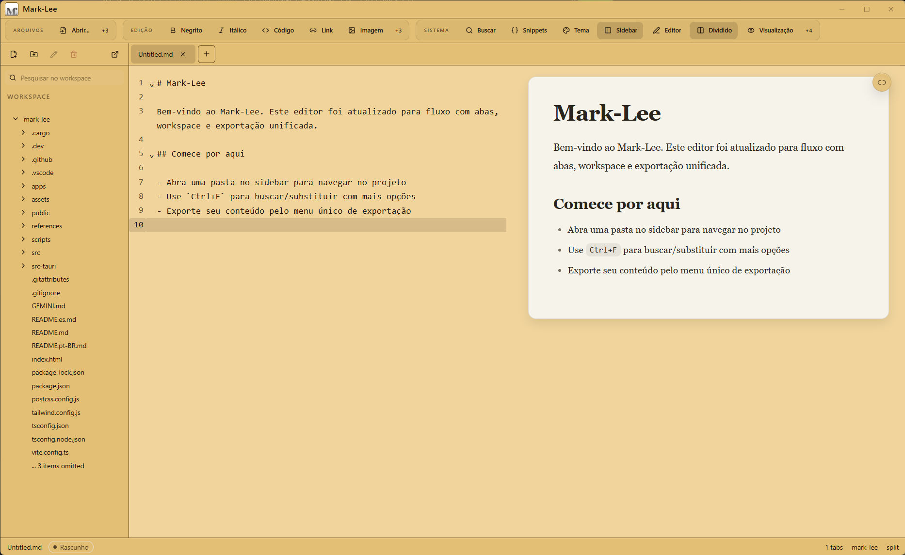

# Mark-Lee

<p align="center">
  
</p>

<p align="center">
  <a href="README.pt-BR.md">Portugues</a> |
  <a href="README.es.md">Espanol</a>
</p>

Mark-Lee is a desktop Markdown editor engineered for performance and focus, bridging modern web technologies with native operating system capabilities through the Tauri framework. It provides a distraction-free writing environment with tabs, workspace navigation, split preview, and robust file management.



## Features

- **Zen Mode** - UI fades away when you stop moving the mouse
- **Focus Mode** - Spotlight effect highlighting only the active paragraph
- **Tabbed Workspace** - Work across multiple Markdown files with a file tree sidebar
- **Split Preview** - Edit and inspect the rendered document side by side
- **Synchronized Scrolling** - Editor and preview move together
- **Professional PDF Export** - A4 layout with clean typography for printing
- **9 Themes** - Light, Dark, Midnight, Sepia, Nord, Synthwave, Forest, Coffee, Terminal
- **Productivity Tools** - Auto-save, Reading Time, and Custom Shortcuts
- **Lightweight** - ~3MB installer, low memory footprint
- **Cross-Platform** - Windows, macOS, and Linux

## Technical Architecture

The application is built on a hybrid architecture that leverages the ecosystem of web development while maintaining the performance and system access of a native application.

*   **Frontend Core**: Built with **React 19** and **TypeScript**, ensuring type safety and component modularity.
*   **Build Tooling**: Uses **Vite 7** for rapid development HMR (Hot Module Replacement) and optimized production bundling.
*   **Styling Engine**: Implements **TailwindCSS 3** for utility-first styling, processed via PostCSS.
*   **Desktop Runtime**: Powered by **Tauri 2 (Rust)**. This layer handles window management, file system IO, and native dialogs, resulting in a significantly smaller binary size and lower memory footprint compared to Electron-based alternatives.

## Project Structure

```
mark-lee/
├── src/                    # React frontend source code
│   ├── App.tsx            # Core editor component
│   ├── components/        # Reusable UI elements
│   └── services/          # File system operations
├── src-tauri/             # Rust backend
│   ├── tauri.conf.json    # Native window configuration
│   └── src/               # Rust source files
├── scripts/               # Node.js automation scripts
└── .github/workflows/     # CI/CD definitions
```

## Getting Started

### Prerequisites

You can automatically check and install most requirements by running our setup script:
```bash
npm run setup
```

**Manual Requirements:**
*   Node.js (v18+)
*   Rust (Latest Stable)
*   **Windows Users**: [Microsoft Visual Studio C++ Build Tools](https://visualstudio.microsoft.com/visual-cpp-build-tools/) ("Desktop development with C++").

### Development

1.  **Installation**:
    ```bash
    npm install
    npm run setup  # Verifies/installs system requirements
    ```
2.  **Local Development (Web)**:
    ```bash
    npm run dev
    ```
    This starts the Vite development server for the web interface.

3.  **Local Development (Desktop)**:
    ```bash
    npm run tauri:dev
    ```
    This launches the application in the native Tauri window.


### Build and Release

#### Local Build
To compile the application for production locally:

```bash
npm run tauri:build
```

The build process compiles React assets via Vite and embeds them into the Rust binary. The final executable is output to `src-tauri/target/release/`.

#### Generating Icons

To generate or update all application icons from SVG files:

```bash
npm run icons
```

This generates all required icon formats (`.ico`, `.icns`, PNG variants) from the source files in `assets/`.

**Custom Icons:**

You can provide your own SVG files as arguments:

```bash
# Using a custom icon
npm run icons -- my-icon.svg

# With theme logos (for light/dark mode in toolbar)
npm run icons -- icon.svg light-logo.svg dark-logo.svg
```

**Default Source Files** (in `assets/`):
| File | Purpose |
|------|---------|
| `logo-icon.svg` | Main app icon (should be square, simple design) |
| `logo-bg_blk.svg` | Toolbar logo for light themes |
| `logo-bg_gray.svg` | Toolbar logo for dark themes |

**Generated Files** (in `src-tauri/icons/`):
- `icon.ico` - Windows application icon
- `icon.icns` - macOS application icon
- `icon.png` - 512x512 base icon
- `32x32.png`, `128x128.png`, etc. - Various sizes
- `Square*.png` - Windows Store logos

---

## Automated Versioning and Release

The project uses GitHub Actions for complete build and release automation.

### Release Guide

#### 1. Prepare the version

**Option A - Using the automatic script (recommended):**
```bash
npm run release -- patch   # 1.0.0 -> 1.0.1 (bug fixes)
npm run release -- minor   # 1.0.0 -> 1.1.0 (new features)
npm run release -- major   # 1.0.0 -> 2.0.0 (breaking changes)
```

**Option B - Manual update:**
Edit the `version` field in these two files:
- `package.json` (line 3)
- `src-tauri/tauri.conf.json` (line 4)

#### 2. Commit the changes

<details>
<summary><strong>Using Terminal (Git CLI)</strong></summary>

```bash
git add .
git commit -m "chore: release v1.0.1"
git push origin main
```
</details>

<details>
<summary><strong>Using GitHub Desktop</strong></summary>

1. Open **GitHub Desktop**
2. The changed files will appear in the left panel
3. In the bottom-left, type a commit message: `chore: release v1.0.1`
4. Click **Commit to main**
5. Click **Push origin** (top bar)

</details>

#### 3. Create the Release Tag

<details>
<summary><strong>Using Terminal (Git CLI)</strong></summary>

```bash
git tag v1.0.1
git push origin v1.0.1
```
</details>

<details>
<summary><strong>Using GitHub Desktop + GitHub Website</strong></summary>

GitHub Desktop doesn't support creating tags directly. Use one of these methods:

**Method 1 - Via GitHub Website:**
1. Go to your repository on GitHub.com
2. Click **Releases** (right sidebar)
3. Click **Draft a new release**
4. In "Choose a tag", type `v1.0.1` and click **Create new tag**
5. Fill the release title: `Mark-Lee v1.0.1`
6. Click **Publish release**
7. Note: This will trigger the build immediately (skip step 4)

**Method 2 - Quick Terminal command:**
Open any terminal in the project folder and run:
```bash
git tag v1.0.1 && git push origin v1.0.1
```

</details>

#### 4. Wait for GitHub Actions

After pushing the tag, GitHub Actions will automatically:
- Build for **Windows** (.exe, .msi)
- Build for **macOS** (.dmg, .app)
- Build for **Linux** (.deb, .AppImage)
- Create a **Draft Release** with all installers attached

You can monitor the build progress at: `https://github.com/YOUR_USERNAME/mark-lee/actions`

Build time: approximately 10-15 minutes for all platforms.

#### 5. Publish the Release

1. Go to **GitHub -> Releases** (`/releases` in your repo)
2. Find the **Draft** release created by the workflow
3. Click **Edit** (pencil icon)
4. Add release notes describing what changed
5. Click **Publish release**

Done! Your release is now live and users can download the installers.

---

### GitHub Actions Workflows

| Workflow | Trigger | Action |
|----------|---------|--------|
| `release.yml` | Push tag `v*` | Build installers for all platforms |
| `pages.yml` | Push to `main` | Deploy web version to GitHub Pages |

### Required GitHub Configuration
1. Go to **Settings -> Actions -> General**
2. Under "Workflow permissions", select **Read and write permissions**
3. Check **Allow GitHub Actions to create and approve pull requests**

---

## Project Files

### `assets/` folder
| File | Purpose |
|------|---------|
| `logo.svg` | Main logo (README, download page) |
| `logo-icon.svg` | Icon source for Tauri icons |
| `logo-bg_blk.svg` | Logo for light themes (toolbar) |
| `logo-bg_gray.svg` | Logo for dark themes (toolbar) |
| `screen.png` | Current screenshot for documentation |

---

## Performance Optimizations

The application implements several optimizations:

- **Lazy Loading**: ReactMarkdown is loaded only when needed
- **150ms Debounce**: Preview doesn't update while typing fast
- **Code Splitting**: Editor, Markdown, React, and parser bundles are split for faster loading
- **Frameless Window**: Lower rendering overhead

### When Minimized
Tauri/WebView automatically reduces CPU usage when the window is not in focus.

---

## License
This project is open source and available under the MIT License.

---

<p align="center">

```
__/\\\\____________/\\\\____________________________________________
 _\/\\\\\\________/\\\\\\_______________________________/\\\_________
  _\/\\\//\\\____/\\\//\\\______________________________\/\\\_________
   _\/\\\\///\\\/\\\/_\/\\\__/\\\\\\\\\_____/\\/\\\\\\\__\/\\\\\\\\____
    _\/\\\__\///\\\/___\/\\\_\////////\\\___\/\\\/////\\\_\/\\\////\\\__
     _\/\\\____\///_____\/\\\___/\\\\\\\\\\__\/\\\___\///__\/\\\\\\\\/___
      _\/\\\_____________\/\\\__/\\\/////\\\__\/\\\_________\/\\\///\\\___
       _\/\\\_____________\/\\\_\//\\\\\\\\/\\_\/\\\_________\/\\\_\///\\\_
        _\///______________\///___\////////\//__\///__________\///____\///__
__/\\\___________________________________________
 _\/\\\___________________________________________
  _\/\\\___________________________________________
   _\/\\\_________________/\\\\\\\\______/\\\\\\\\__
    _\/\\\_______________/\\\/////\\\___/\\\/////\\\_
     _\/\\\______________/\\\\\\\\\\\___/\\\\\\\\\\\__
      _\/\\\_____________\//\\///////___\//\\///////___
       _\/\\\\\\\\\\\\\\\__\//\\\\\\\\\\__\//\\\\\\\\\\_
        _\///////////////____\//////////____\//////////__
```

</p>
