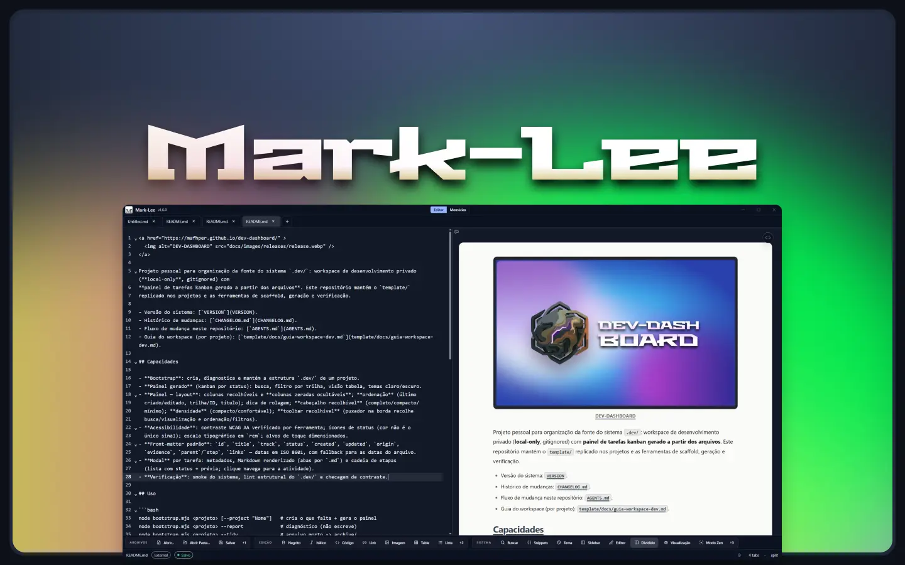
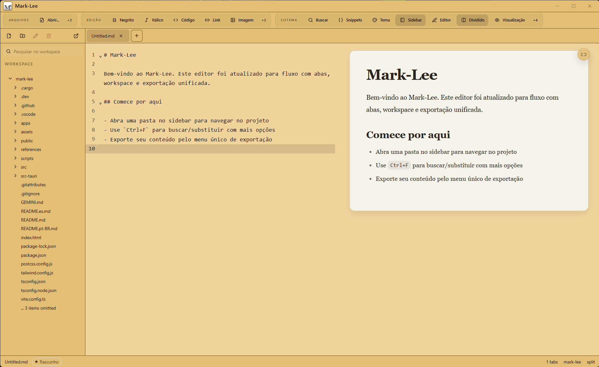

<a href="https://mafhper.github.io/mark-lee/" >
  
</a>

<p align="center">
  <a href="README.pt-BR.md">Português</a> |
  <a href="README.es.md">Español</a>
</p>

**Write what you need. Keep what matters.**

Mark-Lee is a desktop Markdown editor and a journaling space built over **the same
local files**. No account, no closed format, no mandatory server. Open a folder, write
with precision, and find the same content again by time and place.




<p align="center">
  <a href="https://mafhper.github.io/mark-lee/">Website</a> ·
  <a href="#download">Download</a> ·
  <a href="#development">Build from source</a>
</p>

---

## One file, two contexts

The two modes are not separate products that sync between themselves. They are two
ways of looking at the same Markdown on your disk — nothing is converted, duplicated,
or locked into a proprietary format.

| | **Editor** | **Memórias** |
|---|---|---|
| For | Working with precision | Finding things again with context |
| Opens | A folder or file | A local folder, read as a notebook |
| Gives you | Workspace, tabs, search, side-by-side preview | Dated entries by time, place, mood, and tags |
| Ends at | Publication — PDF or Markdown | A calm, theme-aware reading view |

---

## Editor

- **Workspace** — open a folder and navigate it from a sidebar; tabs, search, and
  snippets keep the context in reach
- **Side-by-side** — edit and read the rendered document at once, with synchronized scrolling
- **Zen mode** — the interface fades out when you stop moving the mouse
- **Command palette** — every action reachable by keyboard
- **PDF export** — A4 layout with clean typography
- **12 themes** — light, dark, midnight, sepia, nord, synthwave, neomatrix, forest,
  coffee, golden, firenight, terminal
- **Auto-save** — configurable interval, with unsaved changes marked per tab
- **pt-BR · en-US · es-ES** — the interface ships in three languages

## Memórias

A local-first journaling mode over plain Markdown with YAML front-matter.

- **Notebooks and entries** — a folder becomes a notebook; each dated entry is a file
- **Four views** — list, calendar, photo gallery, and a map of places
- **Rich metadata** — cover image, mood, tags, location, favorites, and your own
  numeric/boolean/text trackers, summarized by day, week, or month
- **Reading view** — a blog-style layout with prev/next paging, respecting the theme
- **Pomodoro** — a floating timer with an optional read-only break lock
- **Resilient** — atomic writes, backups, CRLF-tolerant import, and an asset path guard
- **Quick actions** — right-click any entry to open, favorite, duplicate, edit, or delete

## Download

Windows, macOS, and Linux, from the [releases page](https://github.com/mafhper/mark-lee/releases).

---

## Built on

A native shell with a modern web core — small binary, low memory, real file access.

- **Tauri 2** (Rust) — window, filesystem, native dialogs, file watching
- **React 19** + **TypeScript** — UI and state
- **Vite 8** — dev server and production bundling
- **Tailwind CSS 3** — styling
- **CodeMirror 6** — the editor
- **Leaflet** — the map view in Memórias

Runs in a plain browser too: filesystem and dialog calls fall back to web
implementations, so the UI is fully explorable with `npm run dev`.

---

## Development

**Requirements**

- Node.js **22.22.0** (pinned in CI)
- Rust (stable)
- Windows: [MSVC Build Tools](https://visualstudio.microsoft.com/visual-cpp-build-tools/)
  with the "Desktop development with C++" workload

```bash
npm install
npm run setup   # verifies and installs system requirements
```

**Run it**

```bash
npm run dev        # browser only, Vite on :5173
npm run tauri:dev  # the desktop window
```

**Check it**

```bash
npm run build            # tsc + vite build — this is the typecheck
npm run contrast:check   # theme contrast, also enforced in CI
npm run test:ui-layout   # Playwright layout regression
```

Unit tests are colocated `*.test.ts` files run by Node's built-in runner:

```bash
node --experimental-strip-types --test src/features/journal/domain/entry.test.ts
```

There is no "run everything" script — CI lists each suite explicitly.

**Release**

`npm run release -- patch|minor|major` bumps the version in all three files that carry
it (`package.json`, `src-tauri/tauri.conf.json`, `src-tauri/Cargo.toml`), updates the
window title, and prepends the changelog.

Then: **branch → PR → merge → tag → push.** `main` is protected; only a `v*` tag
triggers a release. The workflow is a thin caller — the protocol lives in
[`release-core`](https://github.com/mafhper/release-core), and this repository owns only
the contract in `.github/release.config.json`.

---

## Layout

```
mark-lee/
├── src/
│   ├── App.tsx            # orchestrator for editor + journal
│   ├── app/               # generic infra: command palette, markdown, hooks
│   ├── features/          # feature modules; journal/ is split by role
│   ├── services/          # filesystem and storage bridges (Tauri + web fallback)
│   └── translations.ts    # pt-BR (default) · en-US · es-ES
├── src-tauri/             # Rust: filesystem, image loader, file watcher
├── apps/site/             # promo site (own package.json, locale-prefixed routes)
├── assets/                # logos and the README screenshot
└── .github/               # CI, release, pages, dependency guard
```

`src/features/journal/` keeps its domain logic in pure TypeScript — parsers,
serializers, and types carry role suffixes and stay free of React, which is what makes
them testable without a browser.

---

## License

MIT — see [LICENSE](LICENSE).

---

<p align="center">

```
__/\\\\____________/\\\\____________________________________________
 _\/\\\\\\________/\\\\\\_______________________________/\\\_________
   _\/\\\//\\\____/\\\//\\\______________________________\/\\\_________
    _\/\\\\///\\\/\\\/_\/\\\__/\\\\\\\\\_____/\\/\\\\\\\__\/\\\\\\\\____
     _\/\\\__\///\\\/___\/\\\_\////////\\\___\/\\\/////\\\_\/\\\////\\\__
      _\/\\\____\///_____\/\\\___/\\\\\\\\\\__\/\\\___\///__\/\\\\\\\\/___
       _\/\\\_____________\/\\\__/\\\/////\\\__\/\\\_________\/\\\///\\\___
        _\/\\\_____________\/\\\_\//\\\\\\\\/\\_\/\\\_________\/\\\_\///\\\_
         _\///______________\///___\////////\//__\///__________\///____\///__
__/\\\___________________________________________
 _\/\\\___________________________________________
  _\/\\\___________________________________________
   _\/\\\_________________/\\\\\\\\______/\\\\\\\\__
    _\/\\\_______________/\\\/////\\\___/\\\/////\\\_
     _\/\\\______________/\\\\\\\\\\\___/\\\\\\\\\\\__
      _\/\\\_____________\//\\///////___\//\\///////___
       _\/\\\\\\\\\\\\\\\__\//\\\\\\\\\\__\//\\\\\\\\\\_
        _\///////////////____\//////////____\//////////__
```

</p>
