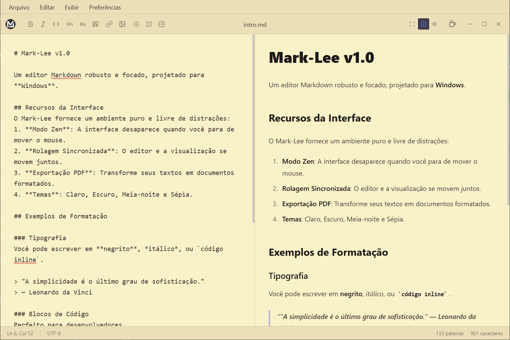

# Mark-Lee

<p align="center">
  
</p>

<p align="center">
  <a href="README.md">English</a> |
  <a href="README.pt-BR.md">Portugues</a> |
  <a href="README.es.md">Espanol</a> |
  <a href="README.fr.md">Francais</a> |
  <a href="README.it.md">Italiano</a> |
  <a href="README.ja.md">日本語</a>
</p>

Mark-Lee 是一款专为性能和专注力设计的桌面 Markdown 编辑器，通过 Tauri 框架将现代 Web 技术与原生操作系统功能完美结合。它提供无干扰的写作环境，具有实时预览渲染和强大的文件管理功能。



## 功能特性

- **禅模式** - 当您停止移动鼠标时，界面自动隐藏
- **专注模式** - 聚光灯效果，仅突出显示当前段落
- **同步滚动** - 编辑器和预览窗口同步移动
- **专业 PDF 导出** - A4 版面，干净的排版，适合打印
- **9 种主题** - 浅色、深色、午夜、复古棕、Nord、Synthwave、森林、咖啡、终端
- **生产力工具** - 自动保存、阅读时间和自定义快捷键
- **轻量级** - 约 3MB 安装程序，低内存占用
- **跨平台** - Windows、macOS 和 Linux

## 技术架构

该应用程序建立在混合架构之上，充分利用 Web 开发生态系统，同时保持原生应用程序的性能和系统访问能力。

*   **前端核心**：使用 **React 19** 和 **TypeScript** 构建，确保类型安全和组件模块化。
*   **构建工具**：使用 **Vite 7** 实现快速 HMR（热模块替换）和优化的生产打包。
*   **样式引擎**：实现 **TailwindCSS 3** 的 utility-first 样式，通过 PostCSS 处理。
*   **桌面运行时**：由 **Tauri 2 (Rust)** 驱动。此层处理窗口管理、文件系统 IO 和原生对话框，与基于 Electron 的替代方案相比，二进制文件更小，内存占用更低。

## 项目结构

```
mark-lee/
├── src/                    # React 前端源代码
│   ├── App.tsx            # 核心编辑器组件
│   ├── components/        # 可复用 UI 元素
│   └── services/          # 文件系统操作
├── src-tauri/             # Rust 后端
│   ├── tauri.conf.json    # 原生窗口配置
│   └── src/               # Rust 源文件
├── scripts/               # Node.js 自动化脚本
└── .github/workflows/     # CI/CD 定义
```

## 快速开始

### 前置要求

您可以通过运行我们的设置脚本自动检查和安装大多数要求：
```bash
npm run setup
```

**手动要求：**
*   Node.js (v18+)
*   Rust（最新稳定版）
*   **Windows 用户**：[Microsoft Visual Studio C++ Build Tools](https://visualstudio.microsoft.com/visual-cpp-build-tools/)（"使用 C++ 的桌面开发"）。

### 开发

1.  **安装**：
    ```bash
    npm install
    npm run setup  # 验证/安装系统要求
    ```
2.  **本地开发（Web）**：
    ```bash
    npm run dev
    ```
    这将启动 Vite 开发服务器用于 Web 界面。

3.  **本地开发（桌面）**：
    ```bash
    npm run tauri dev
    ```
    这将在原生 Tauri 窗口中启动应用程序。

### 构建和发布

在本地编译生产版本：

```bash
npm run tauri build
```

构建过程通过 Vite 编译 React 资源并将其嵌入 Rust 二进制文件。最终可执行文件输出到 `src-tauri/target/release/`。

## 许可证

本项目是开源的，采用 MIT 许可证。

---

<p align="center">

```
                          书写。专注。创作。
```

</p>
